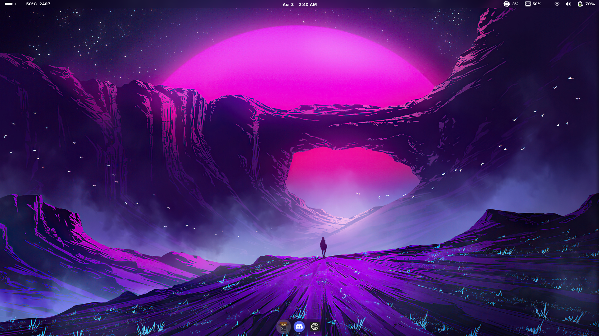
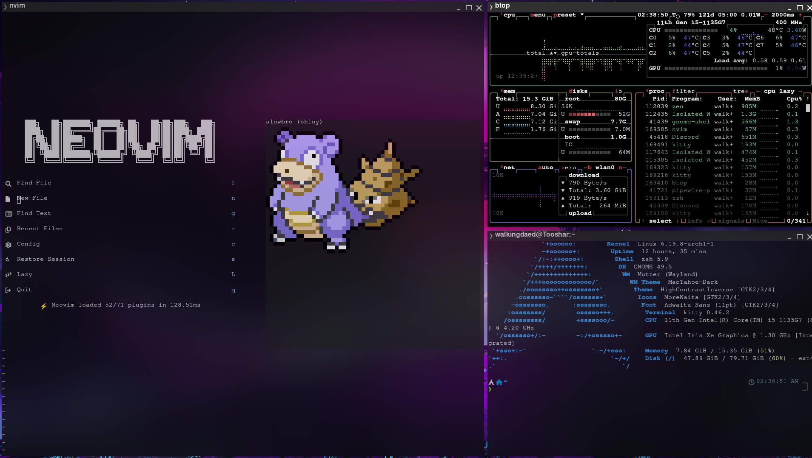
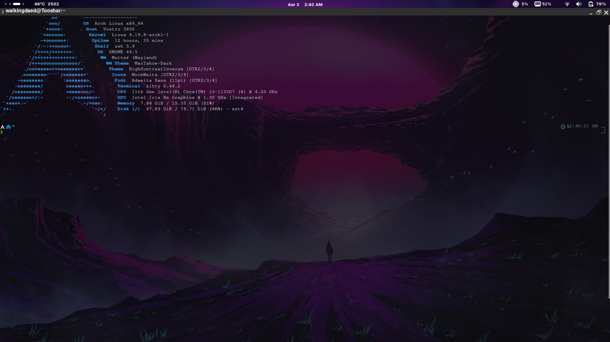
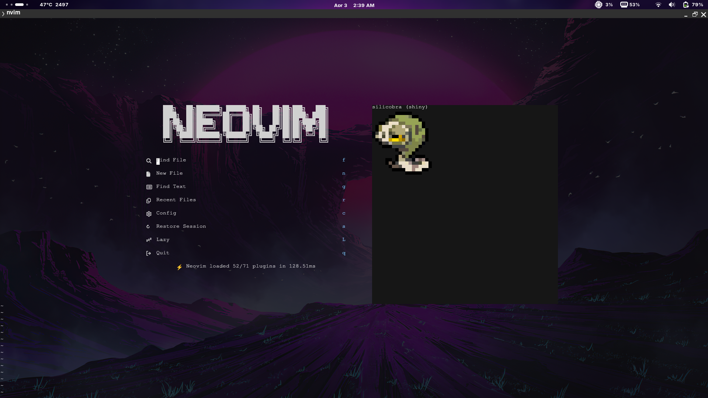
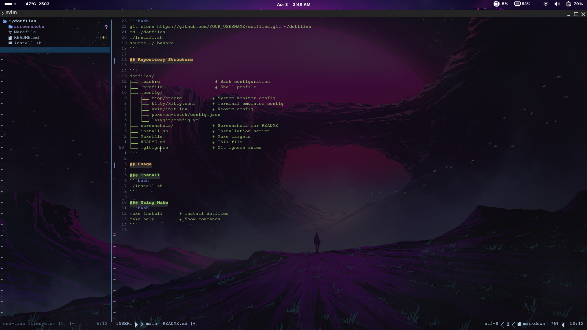
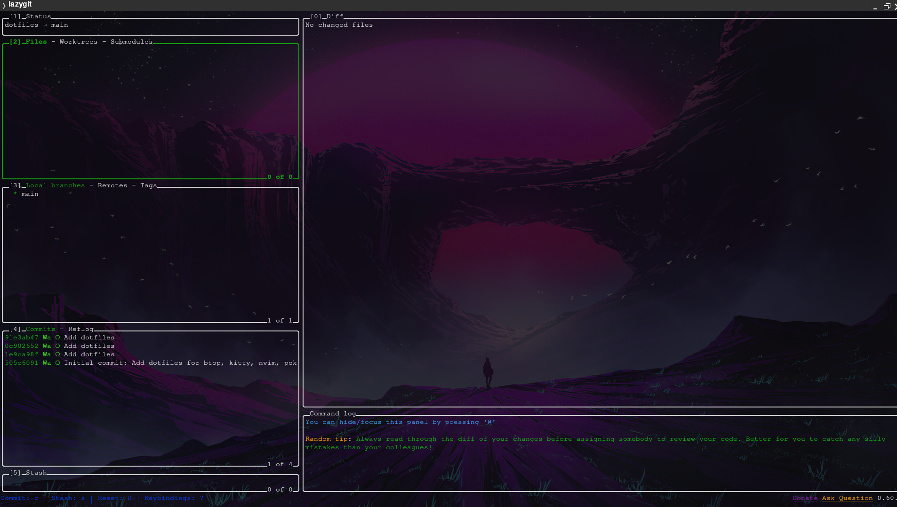

# My Dotfiles

Personal dotfile configurations for btop, kitty, nvim, pokemon-fetch, lazygit, and bash.

## Screenshots

### Desktop


### Config


### Kitty Terminal


### Neovim Homepage


### Neovim Editor


### Lazygit Git Interface

### Prerequisites

Install required tools:

**Ubuntu/Debian:**
```bash
sudo apt-get update
sudo apt-get install -y btop kitty neovim lazygit
pip3 install pokemon-fetch
```

### Setup

```bash
git clone https://github.com/YOUR_USERNAME/dotfiles.git ~/dotfiles
cd ~/dotfiles
./install.sh
source ~/.bashrc
```

## Repository Structure

```
dotfiles/
├── .bashrc                    # Bash configuration
├── .profile                   # Shell profile
├── .config/
│   ├── btop/btoprc           # System monitor config
│   ├── kitty/kitty.conf      # Terminal emulator config
│   ├── nvim/init.lua         # Neovim config
│   ├── pokemon-fetch/config.json
│   └── lazygit/config.yml
├── screenshots/              # Screenshots for README
├── install.sh                # Installation script
├── Makefile                  # Make targets
├── README.md                 # This file
└── .gitignore                # Git ignore rules
```

## Usage

### Install
```bash
./install.sh
```

### Using Make
```bash
make install      # Install dotfiles
make help         # Show commands
```

